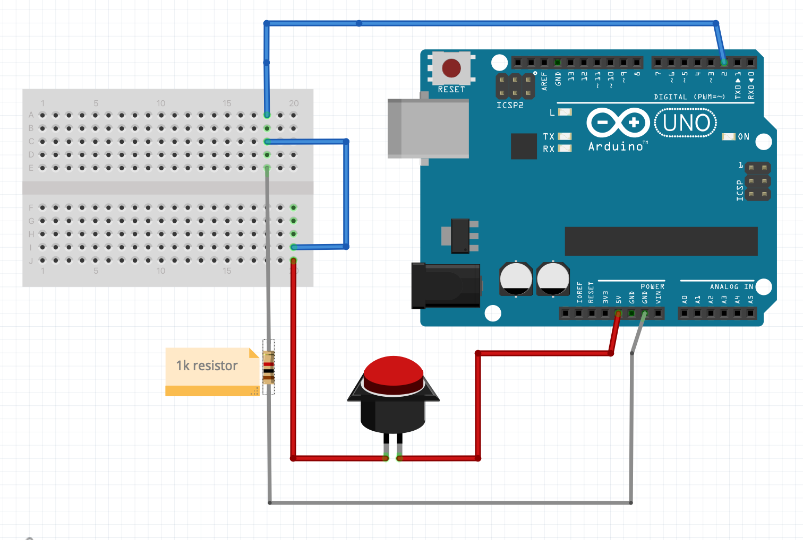
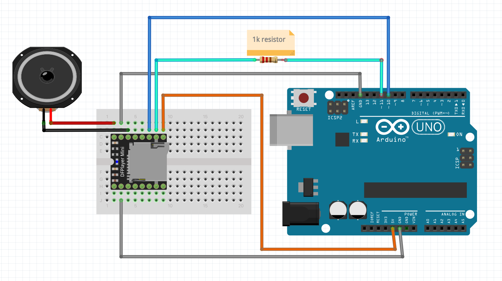
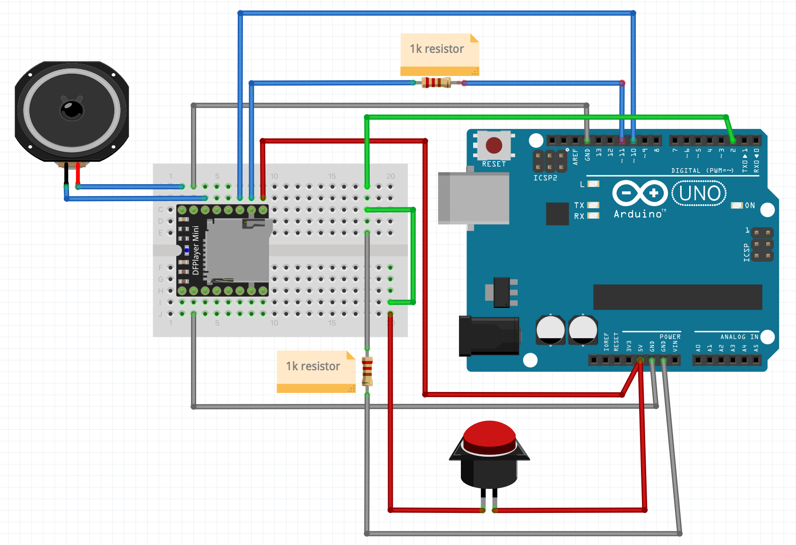

# arduino_sequential_button

Arduino controlled DFPlayer mini playing mp3's sequentially

Simple Button that, when pushed, plays the next mp3 on the SD card via a DFPlayer Mini and Arduino.
(Based on the button example and examples of DFPlayer mini.)
## Button:


## DFPlayer:


## Combined Button Activated MP3 Player:


## Issues I Ran Into

1. **Using the next command from the "DFRobotDFPlayerMini.h" library just resulted in random play.**
    - **Solution:** Use `myDFPlayer.playFolder(folder_number, song_number);`

2. **Using a DFPlayer mini purchased on Amazon - Lacking functionality, could not get it to read file counts in the folder and it would just return -1.**
    - **Solution:** Buy from a reputable store, such as arduino.cc

3. **Not understanding the naming conventions - Resulting in random play.**
    - **Solution:** Choose and follow one of these naming conventions:
        - In folders numbered 01 – 99. File names with 3 digit prefixes 001 – 255. Command 0x0F
        - In a folder named MP3 (or perhaps mp3). File names with 4 digit prefixes 0001 to 3000. Command 0x12
        - In the root directory. File names with 4 digit prefixes 0001 to 3000. Command 0x03
        - In folders named 01 – 15. File names with 4 digit prefixes 0001 – 3000. Command 0x14

4. **Accidentally connecting to PIN3 (instead of PIN2) on the board, would still work 90% of the time but would also activate double with one button push, and also activate if I shook the Arduino.**
    - **Solution:** Connect to the correct PIN.

5. **Hidden "." files and folders when using Mac, some of them couldn't be deleted.**
    - **Solution:** Reformat the SD card each time I added things or deleted them - deleting files was a big no-no.

### Instructions for Formatting an SD Card on Mac:
*Note: Be aware that deleting anything on the SD Card might create a .Trashes file, which can only be deleted by reformatting the card.*

Open Terminal and run the following commands:

1. `sudo diskutil list`
    - This should display something like the following for the SD card:
    ```
    /dev/disk4 (internal, physical):
      #:                       TYPE NAME                    SIZE       IDENTIFIER
      0:     FDisk_partition_scheme                        *31.9 GB    disk4
      1:                 DOS_FAT_32 NO_NAME                 31.9 GB    disk4s1
    ```

2. `sudo diskutil eraseDisk FAT32 MUSIC MBRFormat /dev/disk4`

*Then you need to erase .Spotlight-V100 and .fseventsd:

3. `sudo mdutil -d "/Volumes/MUSIC"`

4. `sudo mdutil -X "/Volumes/MUSIC"`

5. `rm -rf /Volumes/MUSIC/.fseventsd`

*Remove any other .files that have snuck on:

6. `dot_clean -m /Volumes/MUSIC`
